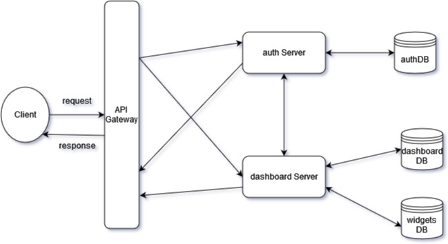

# Dashy Plus Plus

## Microservice Architecture Diagram

## Schema

SQL Schema is available [here](./bin/schema.sql) to create different tables.

## Setup

### Prerequisites

- [Docker](https://docs.docker.com/install/)
- [Docker Compose](https://docs.docker.com/compose/install/)
- Postman
- NodeJS

### Setup

1.  Clone the repository

        git clone https://github.com/mingul26/Dashy-Plus-Plus

2.  Change directory to the cloned repository

        cd Dashy-Plus-Plus

3.  Install _node dependencies_ in each service

        cd auth_service
        npm i
        cd ..
        cd dashboard_service
        npm i
        cd ..

4.  Run the following command to start the server

        docker-compose up

5.  Wait for the containers to start and the server to be alive
6.  Visit this [link](https://documenter.getpostman.com/view/21938946/2s8YespWi2) for the documentation
7.  Click **Run in Postman**
8.  To stop the server, press `Ctrl+C` in the terminal
